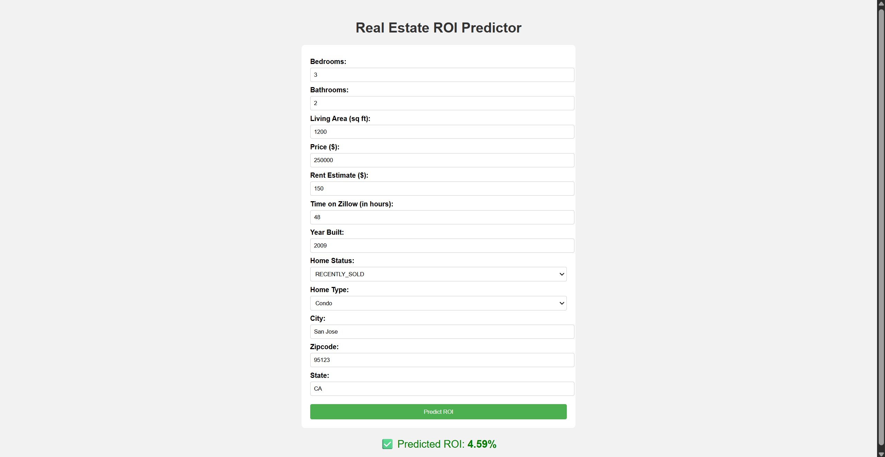
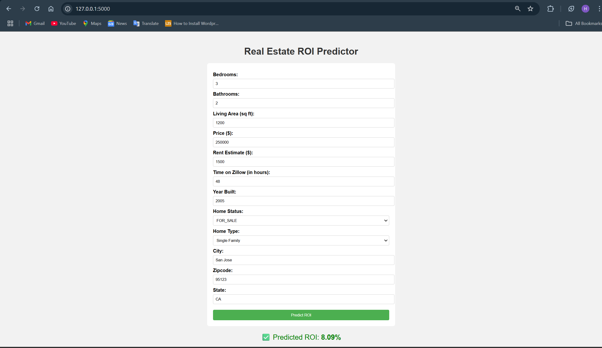

🏡 Real Estate ROI Prediction App

This is a machine learning-powered web application that predicts **Return on Investment (ROI)** for real estate properties based on user input such as bedrooms, bathrooms, rent estimates, price, and more.

Built with:

- 🐍 Python
- ⚙️ Scikit-learn
- 🧠 XGBoost / LightGBM / GradientBoosting
- 💻 Flask for web interface
- 📊 Pandas + NumPy
- 🗂️ Dill for model serialization

---

🚀 Features

- Clean and responsive form-based UI (Flask + HTML/CSS)
- Handles missing values and unseen categories automatically
- ROI (%) prediction displayed with user-friendly formatting
- Modular ML pipeline:
  - `Data Ingestion`
  - `Data Transformation`
  - `Model Training`
  - `Prediction Pipeline`

---

📁 Project Structure

End-to-End/
├── app.py                          # Flask web app
├── templates/
│   └── home.html                   # HTML frontend
├── artifacts/                      # Trained model & preprocessor
│   ├── preprocessor.pkl
│   └── gradient_boosting_roi_model.pkl
├── src/
│   ├── components/
│   │   ├── data_ingestion.py
│   │   ├── data_transformation.py
│   │   └── model_trainer.py
│   ├── pipeline/
│   │   ├── train_pipeline.py
│   │   └── predict_pipeline.py
│   ├── utils.py
│   ├── exception.py
│   └── logger.py
└── data/
    ├── train.csv
    └── test.csv

---

⚙️ Setup Instructions

1. Clone the repository
   git clone
   cd End-to-End
2. Create and activate virtual environment

   python -m venv venv
   venv\Scripts\activate   # Windows
3. Install dependencies
   bash
   pip install -r requirements.txt
4. Train the model

   python -m src.pipeline.train_pipeline

   ✔️ This will generate the trained model and preprocessor under `artifacts/`.
5. Run the Flask app

   python app.py

   Open your browser and navigate to: [http://localhost:5000](http://localhost:5000)

---

🛠️ Tech Stack

| Tool         | Role                |
| ------------ | ------------------- |
| Python       | Core programming    |
| Flask        | Web framework       |
| Scikit-learn | Modeling + pipeline |
| XGBoost / GB | ML models           |
| Pandas       | Data handling       |
| HTML + CSS   | Frontend styling    |

 📧 Contact

If you face any issues or want to collaborate, feel free to reach out:

**Developer:** Hemanth L
📧 Email: hemanth9886609@gmail.com
📍 India

Sample outputs :

